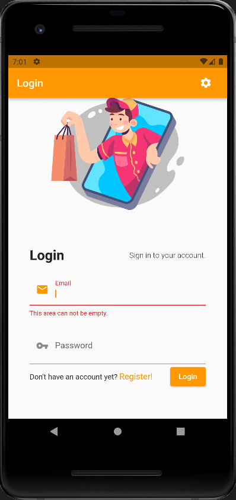
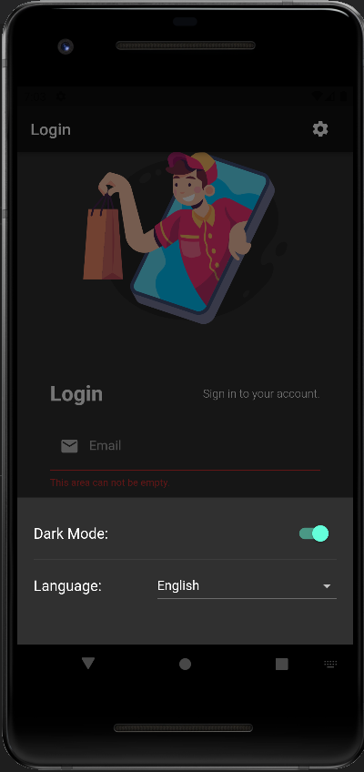
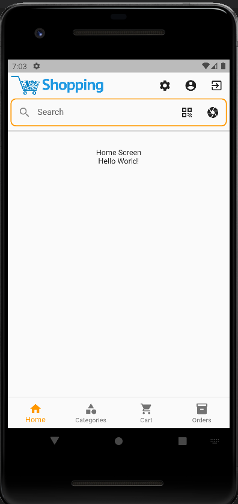
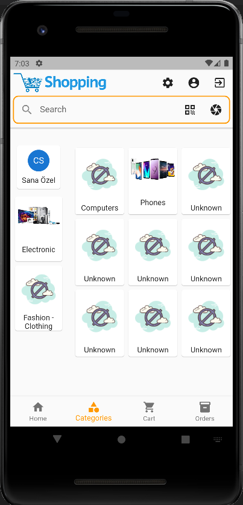
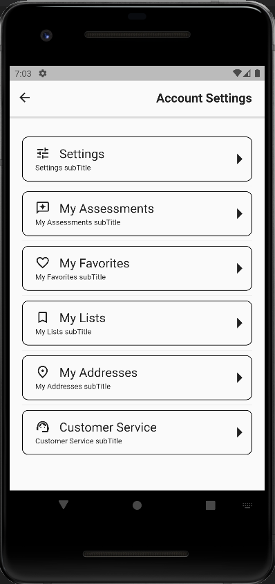
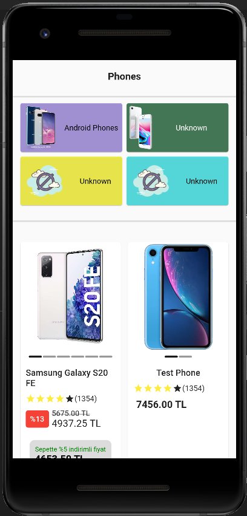
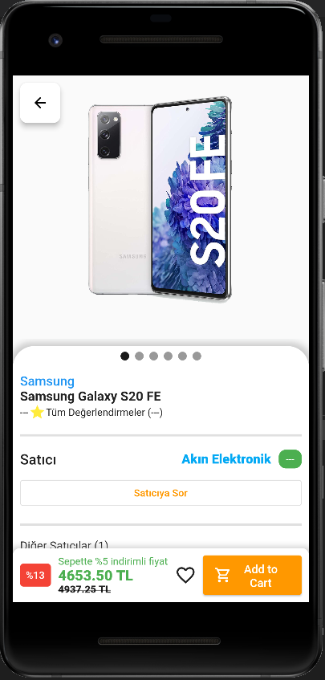

# Flutter & Firebase Shopping App

A shopping mobile app which is made with Flutter and Firebase.

## Screenshots

|                                               |                                               |                                               |
|-----------------------------------------------|-----------------------------------------------|-----------------------------------------------|
|  |  |  |
|  |  |  |  |  |  |  

## Firebase Structure

- **Users** (Collection)
	- email (String)
	- name (String)
	- surname (String)
	- phoneNumber (String)
- **Vendors** (Collection)
	- city (String)
	- contact (String)
	- email (String)
	- name (String)
- **Brands** (Collection)
	- name (String)
	- website (String)
- **Cards** (Collection)
	- name (String)
- **Products** (Collection)
	- **Assessments** (Collection)
		- assessmentId (String)
		- score (Number)
		- userReference (Reference)
	- brandReference (Reference)
	- categoryIds (Array)
	- features (Map)
	- name (String)
	- vendors (Array)
		- cartDiscount (Number)
		- discount (Number)
		- price (Number)
		- vendorReference (Reference)
		- paymentOptions (Array)
			- cardReference (Reference)
			- installments (Array)
				- amount (Number)
				- month (Number)

